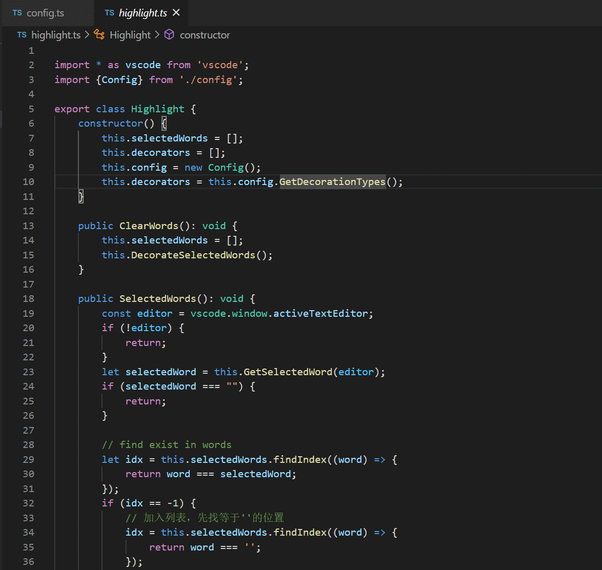
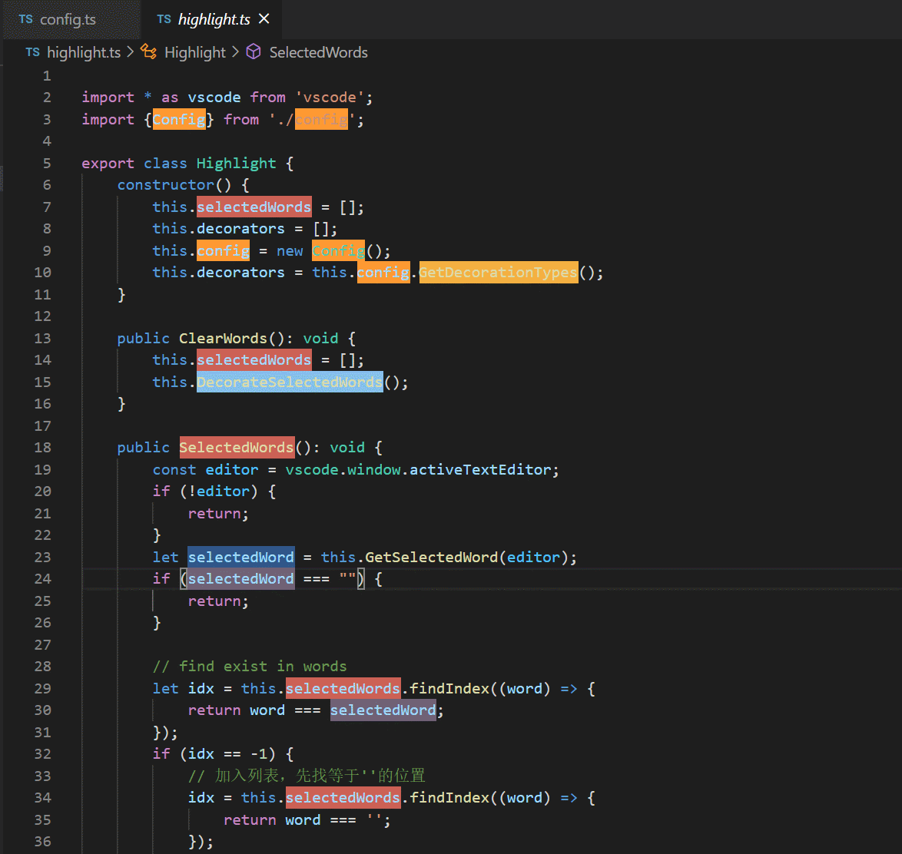

# Highlight README

该插件可将选中的单词进行高亮。

## Features

- 支持选中/取消单词高亮(shift+F8)

  
- 支持全量取消单词高亮(ctrl+shift+F8)

  

## Extension Settings

* `highlight.configuration.wholeWord`: 是否完整单词匹配(boolean)
* `highlight.configuration.ignoreCase`: 是否完整忽略大小写匹配(boolean)
* `highlight.configuration.colors`: 高亮的颜色配置(array)

## Known Issues

N/A

## Release Notes

### 0.1.0

第一个成型的版本

## Reference

reference list:
- https://github.com/rsbondi/highlight-words

**Enjoy!**
